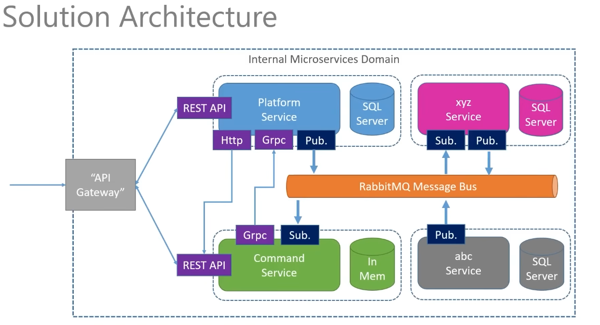
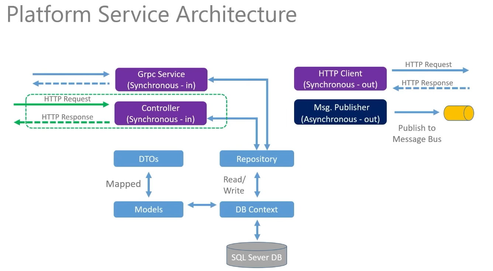
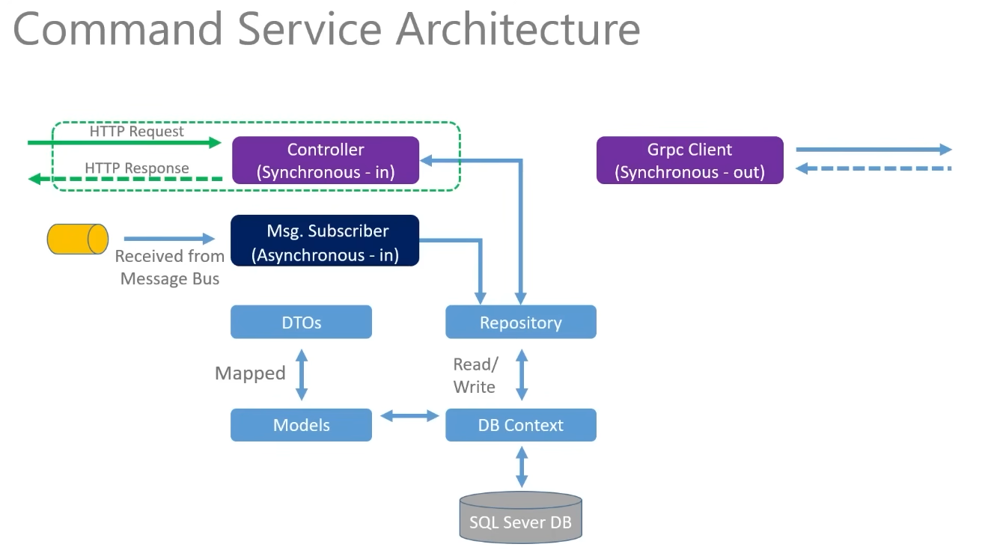
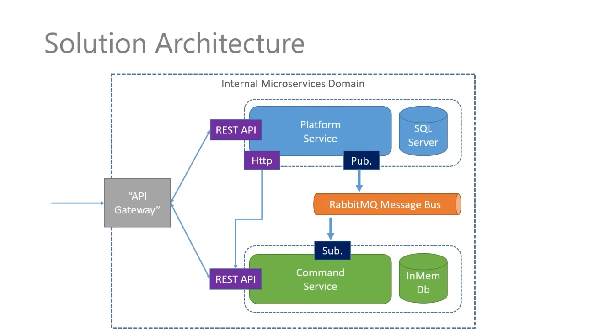
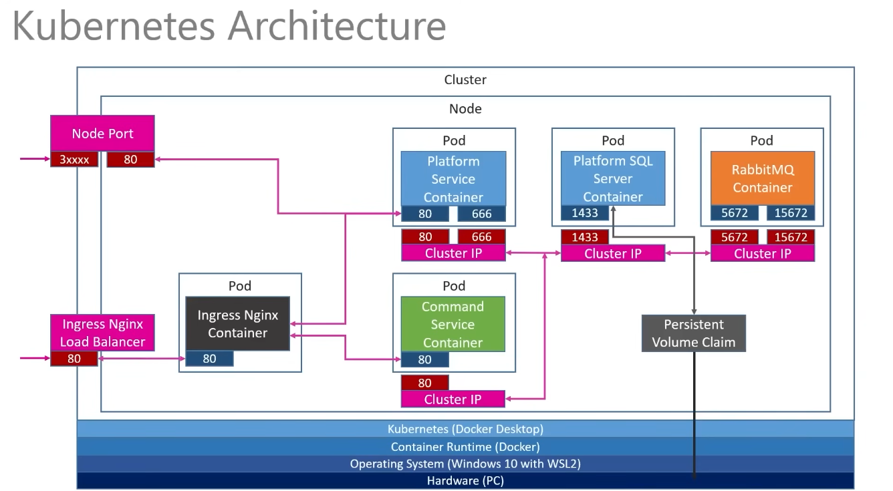

# .NET Microservices Project

This is a learning project that I built while following the **.NET Microservices** course by **Les Jackson**.

The goal of this project was to understand how microservices communicate with each other and how to deploy them using Docker and Kubernetes. I built the project myself, configured the services, fixed deployment issues, and learned how the different technologies work together.

---

## Technologies Used

* C#
* ASP.NET Core 8
* Entity Framework Core
* SQL Server
* REST API
* gRPC
* RabbitMQ
* Docker
* Kubernetes
* NGINX Ingress
* AutoMapper

---

## Architecture

### Solution Architecture



---

### Platform Service



---

### Commands Service



---

### RabbitMQ



---

### Kubernetes



---

## Project Structure

```text
.
├── PlatformService/
├── CommandsService/
├── K8S/
├── images/
└── README.md
```

---

## Communication

This project uses three ways for the services to communicate:

* **REST** for client requests.
* **gRPC** for fast synchronous communication between services.
* **RabbitMQ** for asynchronous event-based communication.

---

## Kubernetes

The application is deployed using Kubernetes.

Resources include:

* Deployments
* ClusterIP Services
* NodePort Service
* SQL Server
* RabbitMQ
* NGINX Ingress

---

## Running the Project

Requirements:

* .NET 8 SDK
* Docker Desktop
* Kubernetes
* kubectl

Deploy everything:

```bash
kubectl apply -f K8S/
```

---

## What I Learned

Working on this project helped me understand:

* Building REST APIs with ASP.NET Core
* Entity Framework Core
* Dependency Injection
* DTOs and AutoMapper
* Repository Pattern
* Docker containers
* Kubernetes basics
* gRPC
* RabbitMQ
* Synchronous vs asynchronous communication
* Basic microservices architecture

---

## Notes

The SQL Server credentials in the configuration files are **local development credentials** used only for running this project on my local machine.

In a real production application, these values should be stored securely using environment variables, Kubernetes Secrets, or another secret management solution.

---

## Acknowledgements

Thanks to **Les Jackson** for creating the .NET Microservices course that this project is based on.
